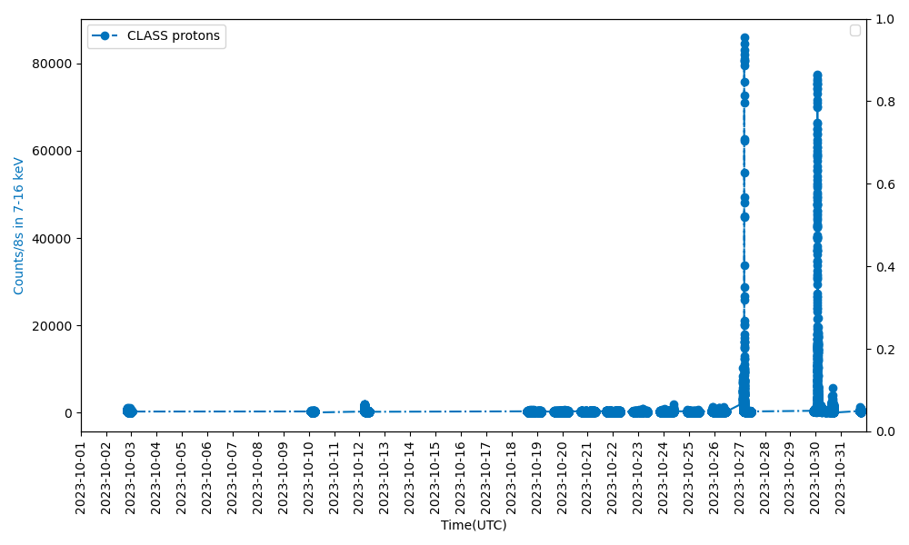

# CH2-CLASS-Pipeline
This pipeline allows the user to download data of class payload of chandrayaan 2 from ISRO's [pradhan](https://pradan.issdc.gov.in/ch2/) website and plot its data(7-16kev) in counts vs time

Last updated and checked for working: 29 Sep 2023

sample image:

I have created this pipeline as a part of the data analysis work I was doing wherein I was seeing correlation between Solar energetic protons (SEPs) from GOES data and CLASS data. This [python notebook](https://github.com/Vai838/CH2-CLASS-Pipeline/blob/main/CLASS_Pipeline.ipynb) file just downloads CLASS data and plots its graph. The part for GOES is excluded from this repo. In case anyone is interested in that code, please contact me.

--------------------------------------------------------------------------------------------------------------------
---

# CH2-CLASS-Pipeline

### Overview
This project analyzes data from the **Chandrayaan-2 CLASS (Chandrayaan-2 Large Area Soft X-ray Spectrometer)**. The pipeline processes and visualizes lunar surface composition data from the CLASS instrument, enabling detailed spectral analysis.

### Features
- **Data Loading**: Downloads and processes CLASS datasets.
- **Spectral Analysis**: Performs basic analysis to identify elemental compositions.
- **Visualization**: Generates plots for easy interpretation of results.

### Requirements
- Python 3.x
- Libraries: `numpy`, `matplotlib`, `astropy`, `selenium`

### Contributing
Feel free to submit pull requests or open issues for bugs or feature requests.

### License
[MIT License](LICENSE)
